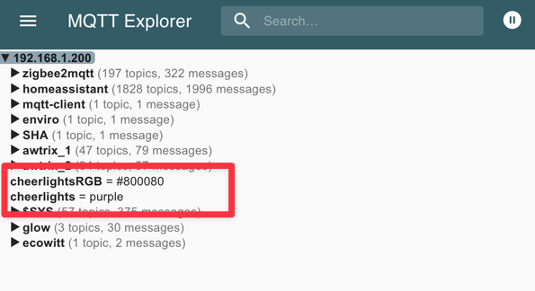
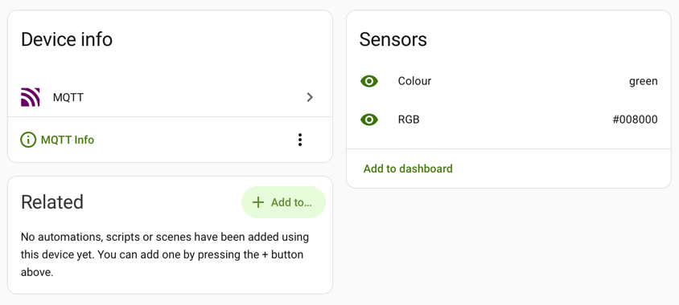

CheerLights is a fun IoT project that creates a global network of synchronized lights controlled by anyone via chat bots on Discord, Telegram, Mastodon and other platforms.

You can find out more about the project on the CheerLights website: [http://cheerlights.com](http://cheerlights.com)

Of course if you have Home Assistant it's likely you have coloured bulbs set up, so integrating CheerLights can be a fun way to sync them with the global network.

There are lots of ways of doing this, but many involve polling, which I wanted to avoid. I went for an MQTT bridge instead. Since I hadn't done this before, it was a learning experience worth documenting.

## Prerequisites
- A working Home Assistant installation.
- Mosquitto MQTT broker installed and configured, either as a docker container or Home Assistant app.
- Mosquitto integration added and configured in Home Assistant.
- The File Editor app if you are using Home Assistant OS.
- MQTT Explorer installed (optional, for validating your MQTT bridge)

# Adding the bridge
A bridge is a connection to another MQTT broker, allowing sharing of messages.  CheerLights provides a public MQTT broker, which we can bridge to our own to allow messages published by CheerLights to appear within a topic within our own MQTT broker.

I'm going to use include directories to keep the bridge configuration organized and separate from the main Mosquitto configuration.  To do this you will need to configure an include folder, this differs depending on your setup.

## Home Assistant Container
Your MQTT broker will be a separate container to Home Assistant and the volumme will be depdenent on your container setup.

You will need to locate the mosquitto.conf file location.

Create a folder called `include` within the same folder as the mosquitto.conf file.

Edit the mosquitto.conf file and add to the end the following line to include the new folder.

```text
include_dir /path/to/include
```
Create a new file called `cheerlights.conf` within the `include` folder with the content below.

## Home Assistant OS
Use the file editor app create a new folder called `mosquitto`.

Go into the Mosquitto broker app configuration (Home Assistant Settings → Apps → Mosquitto broker → Configuration tab).

Open the customise section and ensure that "active" is turned on and set the folder to `mosquitto`.

Save the settings changes and this will create a new folder at `/share/mosquitto`.

Use the file editor app to create a new file called `cheerlights.conf` within the `/share/mosquitto` folder with the content below.

# CheerLights Bridge Configuration

```text title="cheerlights.conf"
connection cheerlights
address mqtt.cheerlights.com
topic cheerlightsRGB in
topic cheerlights in
```

Restart your MQTT broker to apply the new configuration.

This will create two topics within your MQTT broker:
- `cheerlightsRGB` for the RGB colour values.
- `cheerlights` for the textual name of the colour.

You can view them in MQTT Explorer if you have it installed to validate the bridge is working.



These are inbound topics only, nothing from your Mosquitto broker will be sent to CheerLights.

The RGB topic is probably the most useful for automation so feel free to omit the cheerlights one unless you want it for a quick visual reference what the colour is.

# Adding the sensors to Home Assistant

That's the most difficult part done, you now need to add the sensors to Home Assistant which can all be done within the UI.

Go to Settings → Devices & Services → Integrations and click on the MQTT integration.
Click on "Add MQTT device" in the top right.

Enter a device name of `CheerLights` and click Next.
Select the type of device as "Sensor", an entity name of `RGB` and click Next.
Click Next again to proceed to the topic configuration.
Add a state topic of `cheerlightsRGB`
Click Next and your first sensor will be created.

If you want to add the colour name sensor click the cog icon next to the CheerLights device you just created and select Add another entity to CheerLights.
Repeat the above steps but this time use `Colour` for the entity name and `cheerlights` for the state topic.

You should now have a CheerLights device with the sensors you created.



# Automating when the CheerLights colour changes

To automate the lights based on the CheerLights colour, you can use the following Home Assistant automation, replacing the light entity with your own light.

```yaml
alias: CheerLights
description: Set lights to CheerLights colour
triggers:
  - trigger: state
    entity_id:
      - sensor.cheerlights_rgb
conditions: []
actions:
  - variables:
      rgb: >
         
          {{ [hex[0:2] | int(base=16), hex[2:4] | int(base=16), hex[4:6] | int(base=16)] }}
        
          {{ [255, 255, 255] }}
        
  - action: light.turn_on
    metadata: {}
    target:
      entity_id:
        - light.your_light
    data:
      rgb_color: '{{ rgb }}'      
mode: single
```

Although CheerLights has a topic of RGB it is actually a hexadecimal colour string rather than separate red, green, and blue values. The variables section within the automation splits this out to be a list of RGB values suitable for using within the light turn on action.

Note that if you have setup both the RGB and colour name sensors there is a slight delay between the two updating, always automate on one sensor only to avoid inconsistent states.

# Going further

- Create a CheerLights label and add it to the light entities you want to change, replace the target to reference the label rather than an individual light. You can then easily add/remove lights without editing the automation.

- Use the [Spook](https://spook.boo) custom integration's `light.set_color` action to only update lights that are currently on, avoiding surprises.

- Create a sensor template helper to convert the hexadecimal RGB value from the CheerLights sensor into separate red, green, and blue sensors for reuse.

- Use the colour name sensor to set a more subtle colour using your own predefined RGB values that are less intense.
