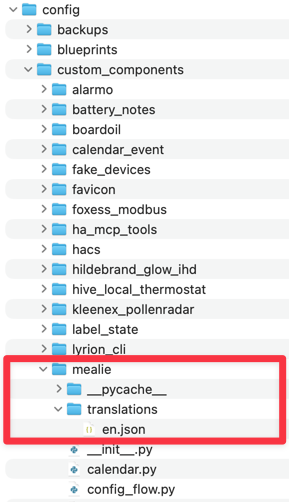
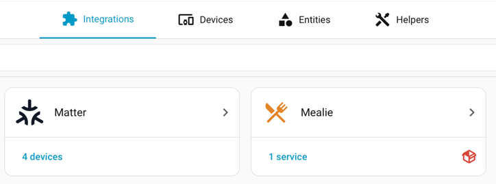

Home Assistant's review process and monthly release cycle can be frustrating when you want a quick fix to a core integration, but you can temporarily run a modified version on your own production instance.

# Warnings

You should know what you are doing here!

Modifying core integrations, especially anything that gets recorded in configuration files, could break things when you revert to the core integration.

Just because a PR has a fix you would like does not mean it will eventually be merged. If you rely on it, you could end up maintaining your own fork of the integration through future updates.

You can only change the backend (Python code) of the integration, not the frontend (UI) components using this method.

With those warnings out of the way, and assuming you have a good reason to do this, let's proceed.

# Copying the files

Grab a copy of the source code from the Home Assistant repository. Choose the release version you are currently running rather than the latest version, to avoid changes that may depend on updates to core in the next release.

The [releases](https://github.com/home-assistant/core/releases) page lists all versions of Home Assistant Core. Pick the version that matches your current installation, open the Assets dropdown, and download the ZIP file.

Locate the core integration you want to modify in the Home Assistant source code and copy its entire directory to a location where you can make changes without affecting the original files. For example:

```bash
cp -r homeassistant/components/<integration> ~/custom_components/<integration>
```

Make your modifications in the `~/custom_components/<integration>` directory.

# Modifying the manifest file

A custom integration requires a version in its `manifest.json` file, while core integrations do not because they are tied to the Home Assistant version.
Without a version, Home Assistant will not recognize the custom integration correctly.

Open the `manifest.json` file in the `~/custom_components/<integration>` directory and add a version at the end. Ensure you have a comma after the previous last entry.

```json
{
  "domain": "<integration>",
  "name": "<Integration Name>",
    …
  "version": "1.0.0-dev"
}
```

Any version number will work. I prefer to use a `-dev` suffix to indicate that it is a development version.

# Create a translation file

Home Assistant source code only contains an English `strings.json` file, which is not used by the integration.
When you build Home Assistant, it creates the proper translation files, but for a quick edit, you will have to do this yourself.

Copy the `strings.json` file from the Home Assistant source code and rename it as an `en.json` file in a `translations` directory of your custom integration. For example:

```bash
mkdir -p ~/custom_components/<integration>/translations
cp homeassistant/components/<integration>/translations/strings.json ~/custom_components/<integration>/translations/en.json
```

If you need to make temporary changes to the translations, you can edit the `en.json` file directly in the `translations` directory.

# Copy and restart Home Assistant

Copy your modified integration to your Home Assistant `custom_components` directory. You should have something like this:



After modifying the integration and updating the manifest file, restart Home Assistant to load the custom integration.

If all goes well, you should see your custom integration loaded correctly in Home Assistant. A red box icon in the bottom right indicates that it is overriding the core integration.



If you do not see the red box icon, Home Assistant is still using the core integration instead of your custom one. Double-check the steps above and look in the logs for clues to help track down the issue.
