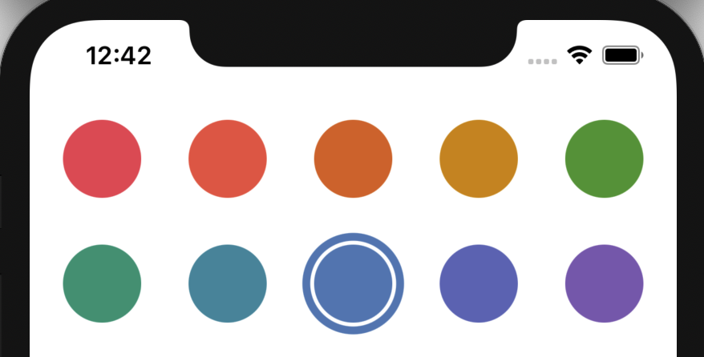
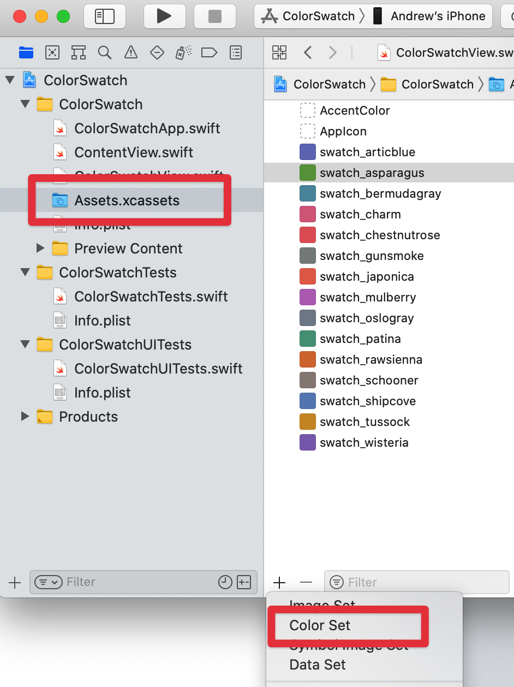
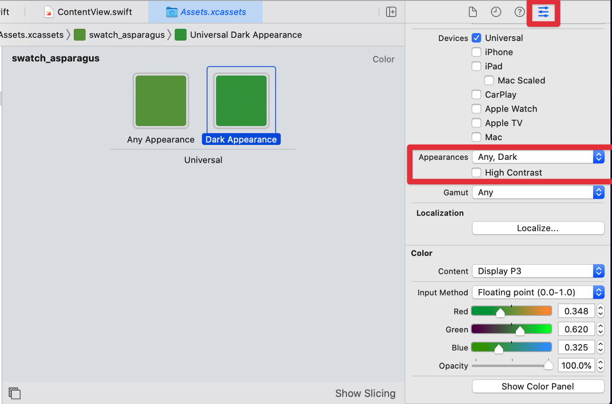
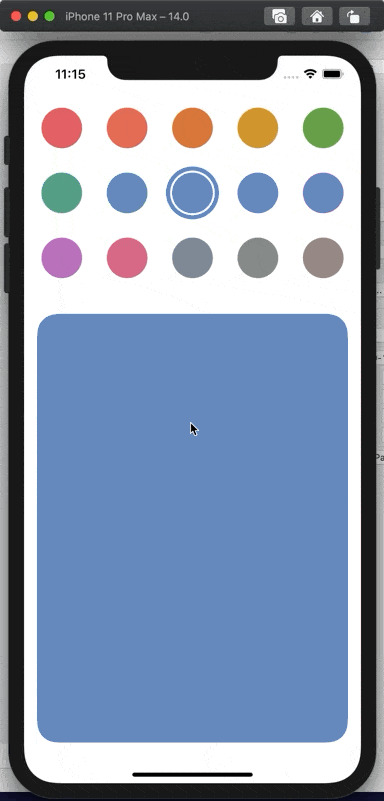

import { Gist } from 'astro-embed';

Color pickers are used frequently in both iOS and Mac apps to differentiate folders/lists/items in Apple’s own app’s like Shortcuts and Reminders and many indie app’s offer similar functionality.

With SwiftUI 2 Apple added the ColorPicker control and you think great, one quick line of code and I have a color picker, but this isn’t constrained, users can pick any color imaginable, great for paint apps, not so great where we are trying to maintain a style to our app and deal with overlaid text or graphics.

Recently watching a non-tech family member discover they can customize their messaging app and the awful contrast choices made you really don’t want to let users have this much power. Even Apple don’t use the generic full palette picker in their apps, instead providing a curated palette to choose from, colors that they know will look good.
When thinking of a solution to this I first started with throwing some RGB colored circles in a list and storing the value. That gets you part of the way but doesn’t allow for colors that adapt well between dark/light mode, high contrast or platform variations for iPhone, iPad, Mac, Apple Watch, TV and CarPlay which all have their own subtle requirements.

In this article I’ll walk you through how I solved this and create a color picker, which I’ve called ColorSwatchView, that can cope with all these different requirements and always present the user with a pleasing color scheme. That’s as long as we can create a pleasing palette for them to choose from in the first place!
Creating the colors

Within Xcode’s Assets file where we usually add our app icon we can also add other assets, one of these being Colors. Adding an asset color allows us to give a name to a color and then add variants for all the different devices/settings we want to cater for. This way we can have varying RGB values but if we always refer to it by name we will get the appropriate variant for the current scenario.

# Adding a Color Set to our assets.

Within our project open the Assets.xcassets file and then use the + button at the bottom of the asset list and select add Color Set, then give our new color set a name, here I have chosen to prefix all my color sets with swatch_ so I can easily tell which I’m using for my swatch view.

Once we’ve created our color set we get a single universal color which we can set using the standard color pickers.

When I first started with Xcode I was confused as to why a single color was called a Color Set. It’s to allow us to create alternative colors for different scenarios which we’ll do now.

# Creating alternative colors
Whilst a single universal color is a good starting point we will probably want to create variants at least for dark mode. To do this we can use the Attribute Inspector button at the top right to get on this pane where we can choose what color variants we want to add. Here I have used the Appearances section to add a dark color but we can use as many combinations of Devices and Appearances as we need to give the best colors for the particular device/setting.

# Creating the Color Swatch View
Now we understand why we should use named color assets and not native colors this part is pretty easy.
We define our color assets as an array of strings, in the order we want them displayed in the swatch grid.  

The <code>@binding</code> property is used to set/hold the currently selected color asset name.

We’re using a <code>LazyVGrid</code> introduced in SwiftUI 2 to automatically layout our color swatch circles, automatically adjusting for the width of the view. We do that by defining our Columns to be adaptive with a minimum width and let <code>LazyVGrid</code> do all the work, it’s not called Lazy for nothing 😀

Within the <code>LazyVGrid</code> we iterate round our named swatches and create a filled circle, colouring the circle by creating a color from our current swatch name. We add an <code>onTapGesture</code> to this to set the selection to be this swatch name.

To show the current selection we conditionally add a slightly larger circle, this time we just want an outline rather than filled. We conditionally show this based on whether the current swatch we are iterating round is equal to the selection.

Because both circles are wrapped in a <code>ZStack</code> they’ll appear on top of each other giving us a nice outlined circle for the current selection.

<Gist id="https://gist.github.com/fcddd8af5f9e9bf5a4123ef5d9d59052" />

# Using the Color Swatch View
To use our newly created ColorSwatchView control we just add it to our view, assign it a <code>@state</code> and for demo purposes I’ve put a rectangle beneath that reflects the currently selected color by setting a <code>fill</code> and creating a <code>Color</code> with our stored asset name. In a real world scenario we’d save this asset name away in our user defaults or other preferred persistent storage.

<Gist id="https://gist.github.com/6b573d614c7337b96946bfb3a2ca8837" />

## Wrap Up
When we run the app we’ll see the Color Swatches displayed in a grid that automatically accommodates the horizontal space available. Choosing a color will change the sample rectangle view below and changing to dark mode will use the slightly more vibrant green color we set.

This is purely a sample and I’m not an expert in color theory so I’ll leave it up to you to decide what variants you need for your particular use cases.

I hope you found this article useful in both how to use Color Sets and also creating a view control for selecting your curated colors.